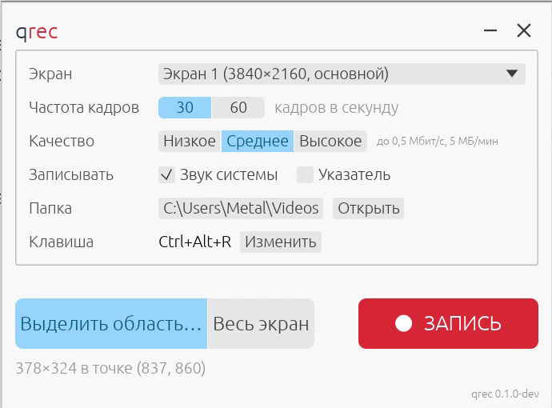

<p align="center">
  
</p>

<p align="center">A simple screen area recorder for Windows</p>

<p align="center">
  <a href="https://github.com/Fan4Metal/qrec/releases/latest"></a>
  
  <a href="LICENSE"></a>
</p>

<p align="center"><b>English</b> | <a href="README.ru.md">Русский</a></p>

qrec records a rectangle of the screen, or a whole display, to an MP4 file: H.264 video encoded by the graphics card, the sound the computer plays as AAC, and the pointer. The window holds the few settings there are, and a global hotkey starts and stops the recording from anywhere.

<p align="center">
  
</p>

*The window of version 0.1.0.*

## Features

- **An area or a display**: the area is drawn with the mouse over a dimmed screen, freely or in the proportions 16:9 or 1:1, and remembered; a red frame marks it while it is recorded.
- **Hardware encoding**: H.264 by the NVIDIA, Intel or AMD encoder of the graphics card through Media Foundation, with Microsoft's software encoder as the fallback; frames go from the screen to the encoder without leaving the graphics card.
- **The sound of the computer without "Stereo Mix"**: whatever is played is captured through WASAPI loopback and written as AAC; no virtual cable or driver is needed.
- **The pointer** is drawn into the recording, including the inverted I-beam.
- **Three settings**: 30 or 60 frames per second, a quality of three steps (the bitrate follows the size of the area), and whether sound and the pointer are recorded.
- **A hotkey**: `Ctrl+Alt+R` by default, changed in the window by pressing another combination, or removed.
- **An icon in the notification area**: red while a recording runs, with the time recorded in its tooltip; its menu starts and stops the recording, and can leave the program in the notification area alone, without a taskbar button, make the window's cross hide it there, or put the window away when a recording starts.
- **Nothing of qrec in the recording**: its own windows are kept out of the capture.
- **Russian and English**: the interface follows the language of Windows, or the one chosen in the About window.
- **One file**: no FFmpeg, no runtime, no network access; the executable is about 7 MB.

## Installation

The installer and the portable archive are published on the [Releases](https://github.com/Fan4Metal/qrec/releases) page.

The installer, `qrec_<version>_Setup.exe`, needs no administrator rights: the program is placed in `%LOCALAPPDATA%\Programs\qrec`. The installed program keeps its settings in `%APPDATA%\qrec`.

The portable archive, `qrec_<version>_portable.zip`, contains the program in a `qrec` folder and runs without installation. It also contains an empty `app.ron` file: while it lies beside `qrec.exe`, the settings are kept in that folder, so the program can be carried on a removable drive (the folder must be writable); without it they are kept in `%APPDATA%\qrec`, as for the installed program.

Requirements: Windows 10 version 2004 or later, 64-bit. On earlier builds of Windows 10 the program runs, but the sound is captured from the default output device instead of through the process loopback (see [Sound](#sound)), and the windows of qrec may appear in the recording.

## Usage

| Setting | Meaning |
|---|---|
| Display | The monitor to record, when there are several. The area belongs to one monitor. |
| Proportions | **Free**, **16:9** or **1:1**: the shape of the area drawn with the mouse. A 16:9 area changes in steps of 2 pixels, its height rounded to the even number H.264 needs, so it is within a pixel of 16:9 and exact where the ratio allows it (1280×720, 1920×1080); a 1:1 area is a square. The corner where the drag starts stays in place, and the area stops at the edge of the monitor. An area already chosen takes the new proportions around its centre. |
| Area | **Select…** hides the window and dims the screen; the area is drawn with the left mouse button, `Esc` or the right button cancels. **Whole display** records the monitor entirely. The current choice of the two is highlighted. The area is remembered between runs. |
| Frame rate | 30 or 60 frames per second. A still screen costs nothing extra: the last image is repeated. |
| Quality | Low, Medium or High: about 0.05, 0.1 or 0.2 bits per pixel and frame. 1920×1080 at 30 frames per second comes to about 3, 6 or 12 Mbit/s. Beside the buttons, the window shows the most the chosen area takes, in Mbit/s and in megabytes per minute with the sound; a still screen takes less. |
| Record | **System sound**: what the computer plays. **Pointer**: the mouse pointer. |
| Folder | Where the files go; `Videos` by default. **Open** shows the folder in Explorer. |
| Hotkey | Starts and stops the recording from any window. A click on **Change**, then a key with `Ctrl`, `Alt` or `Win`, or a function key, sets another one; `Esc` or **Cancel** keeps the current one; the cross beside **Change** removes the hotkey. A combination held by another program is reported as not available. |

**Record** starts the recording; while it runs, the button shows the time recorded and stops the recording when clicked. The number of frames skipped, if the computer could not keep up, appears below. A red frame surrounds the area while it is recorded. The file is named by the date and time, `qrec_2026-10-08_16-45-12.mp4`, and after the recording its name appears in the window as a link that shows it in Explorer.

The area is cut to the monitor it was started on, its sides are made even (as H.264 requires), and it is at least 64 pixels on each side. The whole display is recorded when the area is outside the monitor, for instance after the displays were rearranged.

The icon of qrec in the notification area turns red while a recording runs, and its tooltip shows the time recorded. A click on the icon brings the window to the front; its menu (right button) starts or stops the recording, shows the window, opens **About**, or closes the program. **Not on the taskbar** in the same menu removes the window's button from the taskbar (and from `Alt+Tab`): the minimise button then hides the window, and the icon brings it back. **Hide when closed** makes the cross in the window's corner hide the window instead of closing the program; `Alt+F4` and the **Exit** item still close it. **Minimise when recording starts** minimises the window as a recording starts, however it was started (hidden instead when the window is not on the taskbar). The choices are remembered. Windows 10 places a new icon among the hidden ones, behind the arrow; it can be dragged from there onto the taskbar.

The **i** button in the window's title row (or **About** in the icon's menu) shows the version, the author, the homepage and the licence, where the settings are kept, and the interface language: as in Windows, English or Russian; the choice applies at once and is remembered.

Closing the window during a recording completes the file first.

## Sound

The sound is captured with the *process loopback* of Windows 10 version 2004 and later: the audio engine delivers everything that is played by other programs, in 16-bit stereo at 48 kHz, regardless of the output device and without "Stereo Mix" or a virtual cable. qrec's own sounds, if any, are left out. Programs that play in WASAPI exclusive mode bypass the audio engine and are not captured.

On earlier builds of Windows 10, the default output device is opened for loopback capture instead, which captures what is played through that device.

The audio and the video share one clock, the performance counter of Windows: a packet of sound is placed at the time it was recorded, gaps are filled with silence, and the video frames are stamped at fixed intervals of the same clock, so the two stay in step.

## Limitations

- Displays with HDR enabled are not supported yet: the capture delivers 16-bit floating point frames, which the program does not tone-map. Such a display is reported when the recording starts.
- Rotated displays are captured in their native orientation.
- Content that Windows protects from capture (some video players, DRM) appears black, as in any screen capture.
- One area on one monitor; no pause, no microphone, no webcam.

## Command line

```
qrec.exe --record SECONDS [--region X,Y,W,H] [--monitor N] [--fps N] [--quality low|medium|high] [--no-audio] [--no-cursor] [--out FILE]
```

Records without the window for the given number of seconds, from a console: `--region` is on the virtual screen (physical pixels), `--monitor` counts from 1 with the primary display first, and the defaults are the whole primary display, 30 frames per second, medium quality, with sound and the pointer, into `qrec_<date>_<time>.mp4` in the current folder.

## Building

Requirements: Windows 10 or later, stable Rust with the MSVC toolchain and Visual Studio 2022 Build Tools.

```
cargo build --release    # target\release\qrec.exe
cargo test
```

The window is drawn by egui/eframe through OpenGL (glow). Screen capture, colour conversion, encoding, muxing and audio capture use Windows itself: Desktop Duplication, the Direct3D 11 video processor, Media Foundation and WASAPI, through the `windows` crate. The executable links the C runtime in (`.cargo/config.toml`, `crt-static`), so qrec needs nothing beyond Windows. Setting the environment variable `QREC_TRACE=1` writes what the recording does to stderr (a debug build has a console; a release build shows it when started from one).

## Installer and release

The release script builds the executable, the installer and the portable archive (Inno Setup 6 is required):

```
python tools/make_release.py              # tests, release build, installer, archive
python tools/make_release.py --no-tests   # the same without cargo test
python tools/make_release.py --install    # then a silent installation over the installed copy
```

The files are written to `dist`; the version is taken from `Cargo.toml`. The script first closes a `qrec.exe` running from `target\release`. The installer script is `tools/setup.iss`; the installer icon is written by `qrec.exe --export-icon <file.ico>`.

Releases on GitHub are built by the **Release** workflow (`.github/workflows/release.yml`). After the version in `Cargo.toml` is updated and committed, pushing a matching tag publishes a release with the installer and the portable archive:

```
git tag v0.1.0
git push origin v0.1.0
```

Running the workflow manually (Actions → Release → Run workflow) only builds the files and attaches them to the run, without a release.

## Built with

qrec is built on the following open-source projects:

- [egui / eframe](https://github.com/emilk/egui): the user interface and the window;
- [windows-rs](https://github.com/microsoft/windows-rs): the Windows APIs from Rust;
- [Inno Setup](https://jrsoftware.org/isinfo.php): the installer.

## License

qrec is distributed under the [MIT license](LICENSE).
